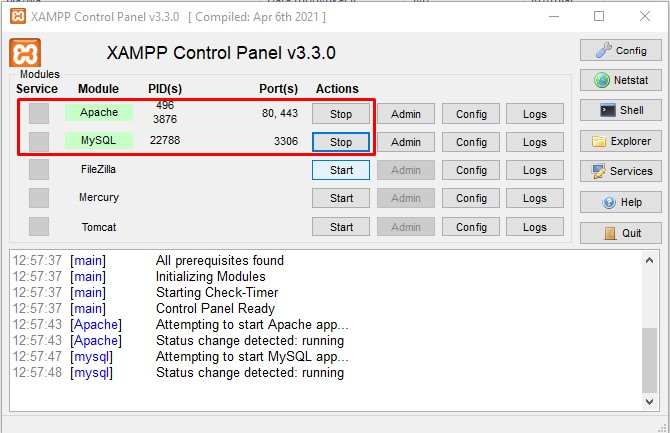

# Personal blog

This projest is a simple personal blog wrote in php programming language.

## Setup

### 1. XAMPP

To run this project you have to have [XAMPP](https://www.apachefriends.org/pl/index.html) installed on your local machine.

To be able to use this app you need activate XAMPP and make sure that to start two first services as shown in the image below.

### 2. Download this repository

You can either clone this repository or download `.zip` file and extract it under `C:\xampp\htdocs` directory.

### 3. Import database

Import [daily_blog.sql](./daily_blog.sql) file to new database created in phpmyadmin.
Here is a step by step guide. You can use [this link](https://scribehow.com/shared/phpmyadmin__import_database__VwNDP7JKTm2oZ5RiKvzHhQ) or see [this file](./readme_files/phpmyadmin_import_database.pdf).

### 4. Access files

In a web rowser of your choisce in a search bar type `localhost\personal-blog` or `localhost\personal-blog-master` if you have dovnloaded `.zip` file.

## Documentation

To see aplication's main features navigate to [this link](https://scribehow.com/shared/Daily_blog_features__3J9n_eicQvGYodoNIoLitg) or see <a href="./readme_files/Daily_blog_features.pdf" download>this file (pdf)</a>.
